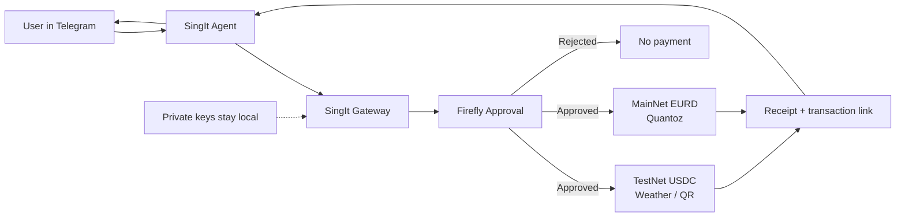

# SingIt

Hardware-approved x402 payments for agentic commerce on Algorand.

The project goal is to let an AI agent access paid x402-protected resources while keeping payment approval under explicit user control. The agent can request a purchase, but a local gateway and Firefly hardware approval step decide whether a real payment is allowed.

> x402 explains how agents pay. SingIt explains how humans safely authorize agents to pay.

## How It Works



- **TestNet rail:** SingIt buys weather data or QR generation through x402 using USDC on Algorand TestNet.
- **MainNet rail:** SingIt sends EURD on Algorand MainNet through the optional Quantoz payment path.
- **Human control:** Firefly must approve the exact payment before the local gateway can submit it.

## What Judges Should Try

Start the local demo stack:

```bash
cd x402HackBerlin

FIREFLY_PORT=/dev/cu.usbmodemXXXX \
SIGN402_PAYMENT_PYTHON="../payment-executor/.venv/bin/python" \
bash scripts/start-local-demo.sh
```

If `payment-executor` is importable in your current Python environment, `SIGN402_PAYMENT_PYTHON` can be omitted. On the demo Mac, replace `FIREFLY_PORT` with the USB modem path shown by `ls /dev/cu.usb*`.

Expose the gateway:

```bash
cloudflared tunnel --url http://127.0.0.1:8099
```

Give SingIt the tunnel URL, approve the policy on Firefly, then try the parameterized paid tools:

```text
buy weather for <city>
buy qr for <url or text>
```

Examples:

```text
buy weather for Dubai
buy weather for Tokyo
buy qr for https://example.com
buy qr for text: Hello Berlin
```

Expected proof:

- Firefly shows `x402 WEATHER` for weather and `x402 QR CODE` for QR.
- SingIt returns compact receipts with paid amount, remaining budget, and clickable Lora transaction links.
- The agent never receives the Algorand private key.

Optional Quantoz proof, if the local mainnet EURD wallet env is configured:

```text
pay 0.01 EURD to <Algorand address>
```

This uses the same Firefly approval step, but settles a real EURD ASA transfer on Algorand MainNet.

## Why This Matters

x402 makes HTTP `402 Payment Required` usable for AI agents, paid APIs, premium data, on-demand compute, and machine-to-machine commerce. That unlocks agentic commerce, but it also creates a trust problem: an autonomous agent should not receive unlimited wallet access just because it can discover paid resources.

SingIt adds the missing consent layer:

- **Policy control:** Firefly approves a deterministic spending policy hash before the agent can spend.
- **Payment control:** Firefly approves the exact payment commitment before the gateway executes it.
- **Private-key isolation:** SingIt never receives the Algorand private key.
- **Auditability:** every paid tool call has a policy hash, payment approval hash, tx id, amount, receiver, and remaining budget.

## Live Proof

The current demo buys the official GoPlausible weather API through x402 on Algorand TestNet USDC:

```text
Telegram command -> SingIt Gateway -> GoPlausible HTTP 402 -> Firefly approval
-> x402-avm PAYMENT-SIGNATURE -> Algorand settlement -> weather result
```

Example receipt:

```text
✅ Dubai Weather: 86°F, Sunny. Paid 0.01 USDC. Tx https://lora.algokit.io/testnet/transaction/MG34CK7NUARHJYB67BCCHYHTCT2JBY67CFRWBDVTSSETI3CGLIRA. Budget left 0.91 USDC.
```

## Alignment With x402 Themes

- **Agentic commerce:** the user talks to SingIt in Telegram; SingIt discovers and buys a paid resource.
- **Internet-native payments:** the gateway handles the official x402 `402 -> payment -> retry` flow.
- **Algorand fit:** low fees, fast finality, and USDC support make small paid API calls practical.
- **Security gap:** Firefly prevents rogue agent spending through hardware-in-the-loop approval.
- **Discovery future:** `GET /agent/tools` is a minimal local paid-tool catalog that can evolve toward Bazaar/MCP-style resource discovery.
- **ARC future:** ARC-90 instant top-ups and ARC-58 scoped account abstraction are natural next steps for reducing always-funded agent wallet risk.

## Agent Discovery

SingIt and other agents can discover the paid-tool catalog directly from the gateway:

```text
GET /agent/manifest
GET /.well-known/x402.json
```

The manifest describes available tools, x402 pricing, Algorand asset/network metadata, Firefly approval requirements, and the compact receipt field agents should return to users.

The gateway also exposes payment rail metadata:

```text
GET /agent/rails
```

Rails:

- `algorand-testnet-usdc`: live demo rail for safe USDC payments on Algorand TestNet.
- `quantoz-eurd-mainnet`: optional live rail for MiCA-aligned EURD payments on Algorand MainNet.

Current paid tools:

- `goplausible.weather` / `get_weather`: buy a weather lookup through the official GoPlausible x402 resource.
- `sign402.qr` / `create_qr_code`: buy QR code generation for a URL or text payload after the same Firefly-approved x402 payment flow.

## Quantoz EURD MainNet Rail

The main hackathon demo stays on Algorand TestNet USDC so judges can run weather and QR purchases safely. The repo also includes an optional Quantoz EURD rail for real euro-denominated mainnet transfers:

- `EURD` on Algorand MainNet, ASA `1221682136`.
- Gateway endpoint: `POST /agent/pay-eurd`.
- Wallet env: `QUANTOZ_WALLET_ENV`, defaulting to `../quantoz-mainnet-wallet.env` on the demo Mac.
- Demo safety limit: `1.00 EURD` per direct EURD payment.

Example request:

```bash
curl -sS -X POST http://127.0.0.1:8099/agent/pay-eurd \
  -H "Content-Type: application/json" \
  -d '{"receiver":"<Algorand address>","amount":"0.01","memo":"SingIt EURD demo"}'
```

Firefly displays `EURD PAYMENT`, the amount, and the receiver short address before the gateway submits the ASA transfer. SingIt should return only the `telegramText` receipt, which includes a mainnet Lora transaction link.

## Planned Architecture

```text
SingIt Telegram agent
  -> SingIt Gateway
  -> Firefly approval layer
  -> x402-avm payment executor
  -> GoPlausible x402 resource
  -> demo dashboard / audit trail
```

## Repository Layout

```text
sign402-gateway/       Local API gateway for agent payment requests
payment-executor/      Payment execution module
sign402-bridge/        Hardware approval bridge
demo-resource-server/  Local x402-style protected demo resource
live-demo/             Demo runner and scripted flows
demo-dashboard/        Browser dashboard for live events
scripts/               Local development and demo scripts
docs/                  Notes, protocol sketches, and demo docs
```

## Development Status

All core components are implemented and tested against live infrastructure:

- `sign402-gateway`: unified local API, Firefly orchestration, paid-tool catalog, discovery manifest.
- `sign402-bridge`: Firefly USB serial approval layer with button handling.
- `payment-executor`: Algorand TestNet USDC sender using `x402-avm`, plus direct ASA transfer support for EURD.
- `live-demo`: strict Firefly-before-payment orchestration layer.
- `demo-resource-server`: local x402-style protected resource for regression and backup demos.
- `demo-dashboard`: live browser audit trail polling the gateway event endpoint.

Verified end-to-end: GoPlausible weather and QR paid-tool purchases through SingIt Telegram with Firefly approval, Algorand TestNet settlement, compact receipts, and clickable Lora transaction links. The EURD rail is implemented as an optional mainnet transfer endpoint for the Quantoz track.

> **Demo note:** `sign402.qr` reuses the live GoPlausible x402 settlement rail for the hackathon demo. The QR artifact is generated by the gateway after a real USDC x402 payment with Firefly approval. In production each paid tool would have its own merchant receiver, resource URL, and price.

## Source Of Truth

- [Security model](SECURITY.md)
- [Project spec](docs/project-spec.md)
- [Roadmap](docs/roadmap.md)

## Local Setup

Install and test individual modules from their package directories as they land.

Expected baseline:

```bash
python3 --version
git status
```

Gateway adapter tests:

```bash
PYTHONPATH=sign402-gateway python3 -m unittest sign402-gateway/tests/test_goplausible_adapter.py
```

Bridge tests:

```bash
PYTHONPATH=sign402-bridge python3 -m unittest discover -s sign402-bridge/tests
```

Payment executor tests:

```bash
PYTHONPATH=payment-executor python3 -m unittest discover -s payment-executor/tests
```

Live demo tests:

```bash
PYTHONPATH=live-demo python3 -m unittest discover -s live-demo/tests
```

Demo resource tests:

```bash
PYTHONPATH=demo-resource-server python3 -m unittest discover -s demo-resource-server/tests
```

## Demo Flow

The intended demo flow:

1. An agent discovers a paid x402 resource.
2. The local gateway inspects the payment requirement.
3. A human approves the exact payment through hardware.
4. The executor submits the payment.
5. The agent retries the protected request with proof of payment.
6. The dashboard shows the approval and payment result.
