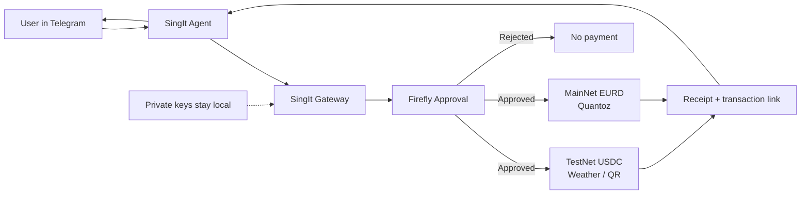

# SingIt

[](https://algorand.co/)
[](https://www.circle.com/en/usdc)
[](https://quantozpay.com/)
[](https://github.com/algorand/firefly)
[](#what-judges-should-try)

SingIt lets AI agents pay for digital services without ever receiving wallet keys. A local gateway checks the request, Firefly requires human approval for the exact payment, and only then is a transaction submitted on Algorand.

**Live demo proof:**

- Weather and QR purchases settle through x402 with USDC on Algorand TestNet.
- EURD payments settle as real ASA transfers on Algorand MainNet through the Quantoz rail.
- Every payment requires physical Firefly approval, and SingIt receives only receipts, not private keys.

> x402 explains how agents pay. SingIt shows how humans safely authorize those agents to pay.

## How It Works



- **TestNet rail:** `goplausible.weather` and `sign402.qr` use x402 with USDC on Algorand TestNet.
- **MainNet rail:** `quantoz.eurd.transfer` sends EURD on Algorand MainNet through the optional Quantoz path.
- **Human control:** Firefly must approve the exact payment before the local gateway can submit it.

## What Judges Should Try

### Voice Demo Moment

Say this to SingIt:

```text
buy weather for New York
```

SingIt turns the voice intent into a paid x402 tool call, but it still cannot spend by itself. Firefly shows the exact payment, the user approves it physically, and only then does the local gateway submit the transaction.

Once the local gateway tunnel is connected to SingIt, try three commands:

```text
buy weather for New York
buy qr for https://github.com/bubon-ik/x402HackBerlin
pay 0.01 EURD to <Algorand address>
```

Expected proof:

- Firefly shows `x402 WEATHER`, `x402 QR CODE`, or `EURD PAYMENT` before money moves.
- SingIt returns compact receipts with paid amount, transaction link, and remaining TestNet budget when applicable.
- The agent never receives the Algorand private key.

To run the local demo stack:

```bash
cd x402HackBerlin

FIREFLY_PORT=/dev/cu.usbmodemXXXX \
SIGN402_PAYMENT_PYTHON="../payment-executor/.venv/bin/python" \
bash scripts/start-local-demo.sh
```

If `payment-executor` is importable in your current Python environment, `SIGN402_PAYMENT_PYTHON` can be omitted. On the demo Mac, replace `FIREFLY_PORT` with the USB modem path shown by `ls /dev/cu.usb*`.

Expose the gateway:

```bash
cloudflared tunnel --url http://127.0.0.1:8099
```

Give SingIt the tunnel URL and tell it to call the local gateway endpoints:

```text
Use SingIt Gateway:
https://<gateway-tunnel>.trycloudflare.com

For TestNet paid tools, call POST /agent/buy-tool.
For MainNet EURD, call POST /agent/pay-eurd.
Return only telegramText for weather and EURD. For QR, include qrImageUrl.
Never request private keys.
```

The EURD command requires the local MainNet wallet env configured with `QUANTOZ_WALLET_ENV`.

## Why This Matters

x402 makes HTTP `402 Payment Required` usable for AI agents, paid APIs, premium data, on-demand compute, and machine-to-machine commerce. That unlocks agentic commerce, but it also creates a trust problem: an autonomous agent should not receive unlimited wallet access just because it can discover paid resources.

SingIt adds the missing consent layer:

- **Policy control:** Firefly approves a deterministic spending policy hash before the agent can spend.
- **Payment control:** Firefly approves the exact payment commitment before the gateway executes it.
- **Private-key isolation:** SingIt never receives the Algorand private key.
- **Auditability:** every paid tool call has a policy hash, payment approval hash, tx id, amount, receiver, and remaining budget.

## Alignment With x402 Themes

- **Agentic commerce:** the user talks to SingIt in Telegram; SingIt discovers and buys a paid resource.
- **Internet-native payments:** the gateway handles the official x402 `402 -> payment -> retry` flow.
- **Algorand fit:** low fees, fast finality, and USDC support make small paid API calls practical.
- **Security gap:** Firefly prevents rogue agent spending through hardware-in-the-loop approval.
- **Discovery future:** `GET /agent/tools` is a minimal local paid-tool catalog that can evolve toward Bazaar/MCP-style resource discovery.
- **ARC future:** ARC-90 instant top-ups and ARC-58 scoped account abstraction are natural next steps for reducing always-funded agent wallet risk.

## Agent Discovery

SingIt and other agents can discover the paid-tool catalog directly from the gateway:

```text
GET /agent/manifest
GET /.well-known/x402.json
```

The manifest describes available tools, x402 pricing, Algorand asset/network metadata, Firefly approval requirements, and the compact receipt field agents should return to users.

The gateway also exposes payment rail metadata:

```text
GET /agent/rails
```

Rails:

- `algorand-testnet-usdc`: live demo rail for safe USDC payments on Algorand TestNet.
- `quantoz-eurd-mainnet`: optional live rail for MiCA-aligned EURD payments on Algorand MainNet.

Current paid tools:

- `goplausible.weather` / `get_weather`: buy a weather lookup through the official GoPlausible x402 resource.
- `sign402.qr` / `create_qr_code`: buy QR code generation for a URL or text payload after the same Firefly-approved x402 payment flow.

## Quantoz EURD MainNet Rail

The main hackathon demo stays on Algorand TestNet USDC so judges can run weather and QR purchases safely. The repo also includes an optional Quantoz EURD rail for real euro-denominated mainnet transfers:

- `EURD` on Algorand MainNet, ASA `1221682136`.
- Gateway endpoint: `POST /agent/pay-eurd`.
- Wallet env: `QUANTOZ_WALLET_ENV`, defaulting to `../quantoz-mainnet-wallet.env` on the demo Mac.
- Demo safety limit: `1.00 EURD` per direct EURD payment.

Example request:

```bash
curl -sS -X POST http://127.0.0.1:8099/agent/pay-eurd \
  -H "Content-Type: application/json" \
  -d '{"receiver":"<Algorand address>","amount":"0.01","memo":"SingIt EURD demo"}'
```

Firefly displays `EURD PAYMENT`, the amount, and the receiver short address before the gateway submits the ASA transfer. SingIt should return only the `telegramText` receipt, which includes a mainnet Lora transaction link.

## Repository Layout

```text
sign402-gateway/       Local API gateway for agent payment requests
payment-executor/      Payment execution module
sign402-bridge/        Hardware approval bridge
demo-resource-server/  Local x402-style protected demo resource
live-demo/             Demo runner and scripted flows
demo-dashboard/        Browser dashboard for live events
scripts/               Local development and demo scripts
docs/                  Notes, protocol sketches, and demo docs
```

## Development Status

All core components are implemented and tested against live infrastructure:

- `sign402-gateway`: unified local API, Firefly orchestration, paid-tool catalog, discovery manifest.
- `sign402-bridge`: Firefly USB serial approval layer with button handling.
- `payment-executor`: Algorand TestNet USDC sender using `x402-avm`, plus direct ASA transfer support for EURD.
- `live-demo`: strict Firefly-before-payment orchestration layer.
- `demo-resource-server`: local x402-style protected resource for regression and backup demos.
- `demo-dashboard`: live browser audit trail polling the gateway event endpoint.

Verified end-to-end: GoPlausible weather and QR paid-tool purchases through SingIt Telegram with Firefly approval, Algorand TestNet settlement, compact receipts, and clickable Lora transaction links. The EURD rail is implemented as an optional mainnet transfer endpoint for the Quantoz track.

> **Demo note:** `sign402.qr` reuses the live GoPlausible x402 settlement rail for the hackathon demo. The QR artifact is generated by the gateway after a real USDC x402 payment with Firefly approval. In production each paid tool would have its own merchant receiver, resource URL, and price.

## Source Of Truth

- [Security model](SECURITY.md)
- [Project spec](docs/project-spec.md)
- [Roadmap](docs/roadmap.md)

## Local Setup

Install and test individual modules from their package directories as they land.

Expected baseline:

```bash
python3 --version
git status
```

Gateway adapter tests:

```bash
PYTHONPATH=sign402-gateway python3 -m unittest sign402-gateway/tests/test_goplausible_adapter.py
```

Bridge tests:

```bash
PYTHONPATH=sign402-bridge python3 -m unittest discover -s sign402-bridge/tests
```

Payment executor tests:

```bash
PYTHONPATH=payment-executor python3 -m unittest discover -s payment-executor/tests
```

Live demo tests:

```bash
PYTHONPATH=live-demo python3 -m unittest discover -s live-demo/tests
```

Demo resource tests:

```bash
PYTHONPATH=demo-resource-server python3 -m unittest discover -s demo-resource-server/tests
```
